# About this guide

RaceWorks is an Excel workbook full of macros: small programs behind its toolbar buttons that
handle event and driver entry, draw, scheduling, timing and results reporting. Out of the box, Excel blocks macros in files it doesn't know, so it needs
a few settings changed once, on each computer you time with. This guide walks you through them.

It takes about ten minutes. You do it once per computer, not once per race.

This guide describes **RaceWorks 2026.1**. Where earlier versions behave differently, it says so.

::: note
**Tested on:** Excel 2013 (32-bit) on Windows 11. Newer versions of Excel (2016, 2019, 2021,
2024 and Microsoft 365) put these settings in the same places, but some wording and behavior
differs. Where this guide describes a newer version, the information comes from Microsoft's
documentation, not from testing. **Your results may vary.** If something looks different,
please tell the maintainer (see *Getting help* at the end).
:::

# Before you start

## Use 32-bit Excel

::: warning
**RaceWorks is developed and tested only on 32-bit Excel. It has not been tested on 64-bit
Excel, so use 64-bit Excel at your own risk.** It's likely to work: no specific 64-bit problem
is known. But if you do hit one, it may take a while to fix, so please report it to the
maintainer.
:::

To check which you have: in Excel, click **File > Account > About Excel**. The first line of
the window that opens ends in "32-bit" or "64-bit".

Since Office 2019, Microsoft installs the 64-bit version unless you choose otherwise. If you
are installing Office fresh, choose the 32-bit version (in Microsoft 365 it is under the
additional install options). If you already have 64-bit Office, changing means uninstalling
and reinstalling it.

## Use a computer you control

If you can, use a personal computer, or one you control, rather than a work or school
computer. On computers managed by an organization:

- the settings in this guide may be grayed out, or quietly ignored;
- security software may block parts of RaceWorks without any message;
- changing security settings may be against the organization's rules.

If you must use a managed computer and the settings are grayed out, ask your IT department to
add your RaceWorks folder as a Trusted Location. Please don't try to work around their settings.

## What you will set up

1. A **RaceWorks folder** in your Documents folder, to keep RaceWorks in.
2. Excel's **macro setting**: the normal, safe default.
3. A **Trusted Location**: your RaceWorks folder, so RaceWorks runs without Excel blocking it.

You make all the Excel changes with **Excel open on its own, not RaceWorks**. Step 2 explains
how. The same applies whenever you come back to change a setting later.

# Step 1 - Make a RaceWorks folder

1. Open **File Explorer** and go to **Documents**.
2. Create a new folder called **RaceWorks**.
3. Copy the RaceWorks workbook (the `.xlsm` file) into it. Always open RaceWorks from this
   folder, and keep your race files here or in subfolders of it.

::: warning
**Keep only RaceWorks files in this folder.** In Step 5 you tell Excel to trust everything in
it, so any file saved here can run macros without asking. Don't save downloads or email
attachments here unless they are RaceWorks files from a source you trust.
:::

If your Documents folder is backed up to **OneDrive**, **Dropbox** or a similar service, that's
a good thing: your race files are copied off the laptop as you save, provided you have internet connectivity. Read *Using OneDrive,
Dropbox or another sync folder* below before race day.

# Step 2 - Open the Trust Center

All of Excel's security settings live in the **Trust Center**.

::: warning
**Make these changes with Excel open on its own, not with RaceWorks open.** RaceWorks'
start-up windows get in the way, and if RaceWorks can't start properly (see *Troubleshooting*)
you won't be able to reach the settings at all. Close RaceWorks (and Excel) first. Then start Excel from the **Start menu**, not by double-clicking the RaceWorks file, and
choose **Blank workbook**.
:::

With a blank workbook open:

Click the **File** tab.

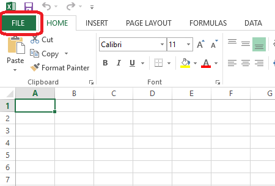

Click **Options** at the bottom of the list on the left.

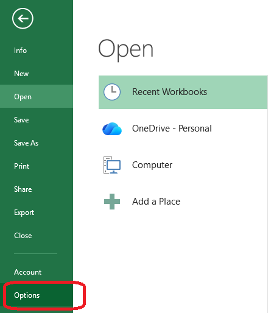

In Excel Options, click **Trust Center** in the list on the left.

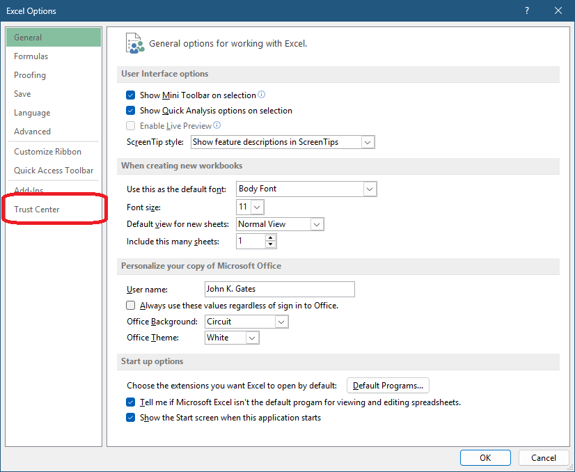

Click the **Trust Center Settings...** button.

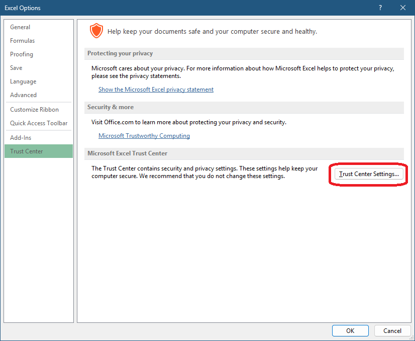

# Step 3 - Macro settings

In the Trust Center, click **Macro Settings** on the left, then:

1. Under *Macro Settings*, choose **Disable all macros with notification**. This is Excel's
   normal default. (In newer Excel it reads *Disable VBA macros with notification*.) You do
   **not** need *Enable all macros*: the Trusted Location in Step 5 lets RaceWorks run.
2. Under *Developer Macro Settings*, leave **Trust access to the VBA project object model**
   **unticked**. RaceWorks doesn't need it. (Versions before 2026.1 may: if Excel freezes
   while RaceWorks starts, see *Troubleshooting*.)

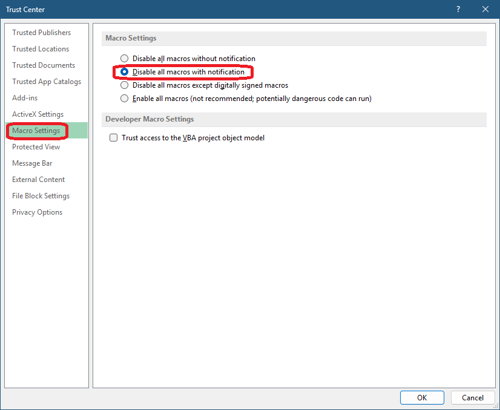

# Step 4 - Leave the network option off

Click **Trusted Locations** on the left. At the bottom, make sure **Allow Trusted Locations
on my network (not recommended)** is **not** ticked. You only need it if you run RaceWorks
from a network share; see *Running RaceWorks from a network share* below.

Then click **Add new location...**

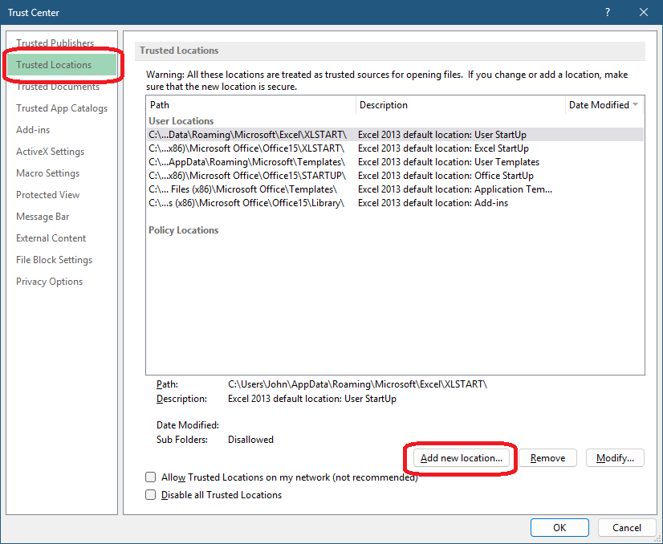

# Step 5 - Add your RaceWorks folder as a Trusted Location

In the *Microsoft Office Trusted Location* window:

1. Click **Browse...**, find your **Documents > RaceWorks** folder, select it and click **OK**.
   Use Browse rather than typing the path: the exact path depends on your computer, and is
   different again if Documents is backed up to OneDrive.
2. Tick **Subfolders of this location are also trusted**, so race files in subfolders work too.
3. Optionally type a **Description**, such as *RaceWorks*.
4. Click **OK**.

The screenshots show `C:\Users\John\Documents\RaceWorks`. Your own user name appears in
place of *John*.

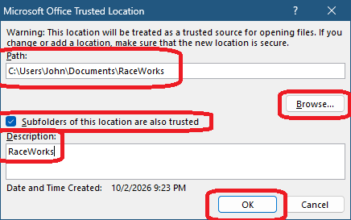

::: warning
**Trust only the RaceWorks folder.** Never add your whole Documents folder, Desktop, Downloads
or a whole drive such as `C:\`. Everything in a Trusted Location can run macros without asking.
:::

Your RaceWorks folder now appears in the list under *User Locations*. Click **OK** to close
the Trust Center.

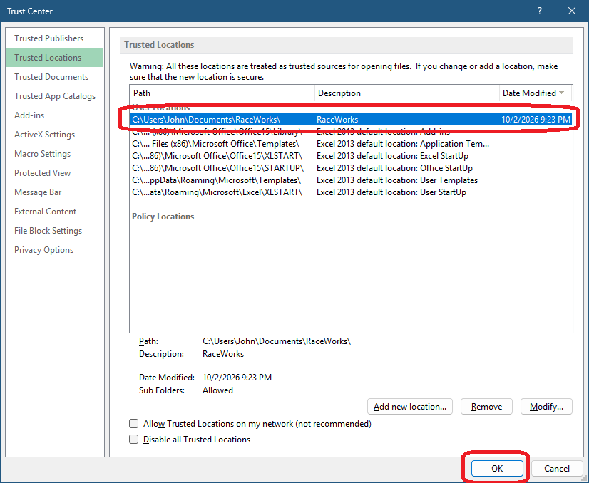

# Step 6 - Close Excel Options and restart Excel

1. Click **OK** in Excel Options as well. If you click Cancel or close the window with the X,
   your changes are not saved.
2. **Close every Excel window**, so the new settings take effect.

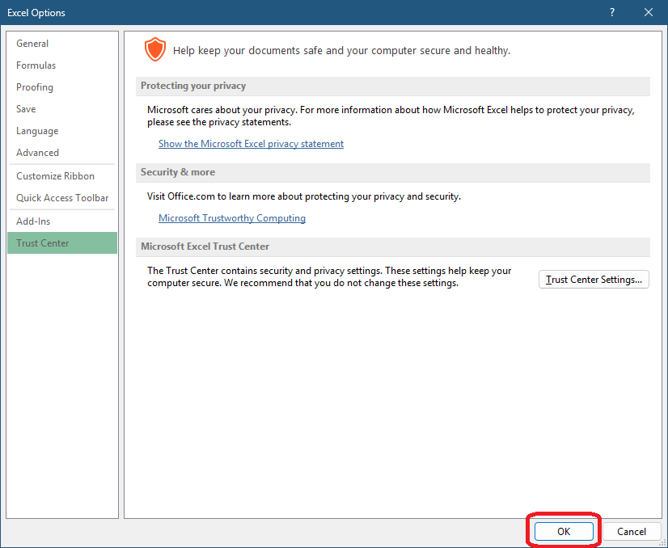

# Step 7 - Check that it works

Open RaceWorks **from your RaceWorks folder**. If everything is set up correctly:

- there is **no** yellow or red bar across the top of the sheet;
- the RaceWorks start-up windows appear (for example, the event information form);
- the RaceWorks toolbars are on the **Add-Ins** tab of the ribbon. Some buttons are grayed
  out at first. That is normal: they are enabled as you work through setting up a race;
- Excel's formula bar, status bar, row and column headings and gridlines are hidden. That is
  normal: RaceWorks hides them on purpose.

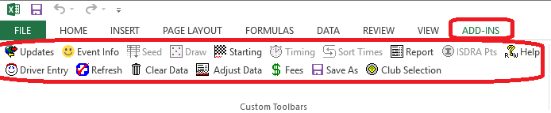

::: note
RaceWorks' own windows can't be closed with the **X** in the corner. Use the buttons on the
window instead. RaceWorks windows sometimes open *behind* other windows, which makes Excel
look stuck. If nothing seems to happen, press **Alt+Tab** to look for the hidden window.
:::

::: warning
**Open only one RaceWorks file at a time.** Excel has just one set of RaceWorks toolbars,
shared by every open workbook. With two RaceWorks files open at once, the buttons can act
on the wrong file. Close one RaceWorks file before opening another. (RaceWorks saves itself
when you close it, so there's no "Save changes?" question.)
Other spreadsheets are fine to have open alongside RaceWorks, but **close RaceWorks last**
(see *Troubleshooting*).
:::

# Files you receive by download or email

Windows marks files that come from the internet or from email (this is called the
*Mark of the Web*), and Excel treats them with extra suspicion.

- **Save the file straight into your RaceWorks folder.** Files in a Trusted Location skip
  most of these checks.
- **Then unblock it**, before you open it: right-click the file in File Explorer, choose
  **Properties**, tick **Unblock** at the bottom of the *General* tab, and click **OK**. (If
  there is no Unblock box, the file is not blocked.) Doing both covers every version of Excel.
- **ZIP files:** unblock the ZIP file *before* extracting it. Otherwise every file you extract
  is marked too.

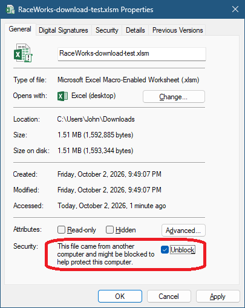

**Microsoft 365:** since 2022, Microsoft 365 blocks macros completely in marked files, with a
red bar that reads *SECURITY RISK: Microsoft has blocked macros from running because the
source of this file is untrusted*. There is no button to enable them. Close Excel, then move
the file into your RaceWorks folder and unblock it, as above. (From Microsoft's
documentation; not tested.)

# Using OneDrive, Dropbox or another sync folder

Keeping your RaceWorks folder in a synced folder is a good idea: each time you save while the
laptop has an internet connection, a copy goes to the cloud, which protects your race results
if the laptop fails. Without a connection, nothing is copied until the laptop is back online;
the sync service then uploads your changes. Some race sites have options for internet connectivity but some do not.

For a backup that doesn't need any connection, also copy your RaceWorks folder to a **USB
stick** at the end of each race day.

**However, there are a few important things to know about sync folders:**

- **Make sure the files are on the laptop before you leave for the race.** OneDrive
  (*Files On-Demand*) and Dropbox (*online-only files*) can keep files only in the cloud,
  leaving a placeholder on the laptop. With no internet at the race site, such a file won't
  open. Right-click your RaceWorks folder and choose **Always keep on this device** (OneDrive)
  or **Make available offline** (Dropbox).
- **Closing doesn't undo mistakes.** RaceWorks saves itself whenever you close it, so you
  can't undo a mistake, such as clicking **Clear Data** by accident, by closing without
  saving. Keep a copy before big steps (**Save As** on the RaceWorks toolbar). OneDrive and
  Dropbox both keep *version history* (right-click the file > *Version history*), which can
  bring back an earlier copy.
- **AutoSave (Microsoft 365 with OneDrive).** For files in OneDrive, Microsoft 365 also turns
  on *AutoSave*, which saves every change the moment you make it, not just when you close.
  You can turn it off with the switch at the top left of the Excel window. Excel 2013 has no
  AutoSave, and Dropbox does not use it.
- **The folder path is different.** With OneDrive backup, Documents is inside your OneDrive
  folder (for example `C:\Users\John\OneDrive\Documents\RaceWorks`). That is why Step 5 uses
  **Browse...** instead of a typed path.

::: note
**Not tested: Microsoft 365 with OneDrive.** Microsoft 365 can open OneDrive files using a web
address internally rather than the folder path. We have not been able to confirm that a Trusted
Location still applies in that case. If RaceWorks shows a macro warning even though it is in
your trusted RaceWorks folder on OneDrive, please tell the maintainer.
:::

# Running RaceWorks from a network share

::: note
**Most people should skip this section.** It only applies if you open RaceWorks directly
from a shared folder on another computer, server or NAS. Usually that means ISDRA
staff or the RaceWorks maintainer, or someone working on race files from a home NAS before
or after a race. 

On race day, it's expected that RaceWorks would be run from the laptop itself, not a network
share.  If you copy RaceWorks onto your laptop and run it from your RaceWorks folder, as this guide describes above, none of this applies to you.
:::

If you do run RaceWorks from a network share:

1. In **Trusted Locations**, tick **Allow Trusted Locations on my network (not recommended)**,
   then click **Add new location...**

   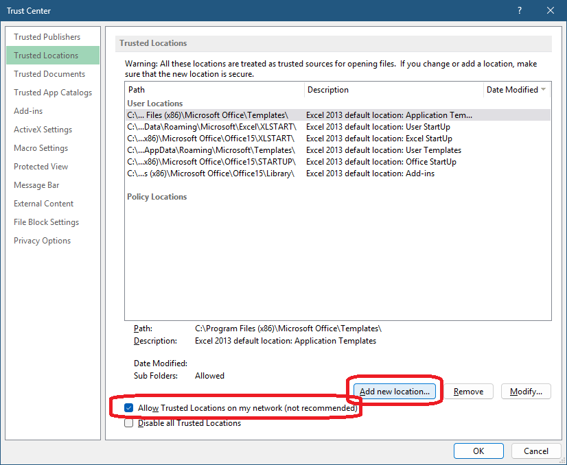

2. Enter the share's path, using the **server's name**, for example
   `\\Fileserver\Share\ISDRA\Raceworks\`. Tick **Subfolders of this location are also
   trusted** and click **OK**.

   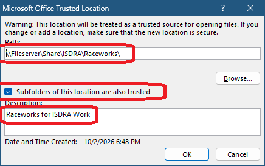

3. Check the new entry is in the list, then click **OK**.

   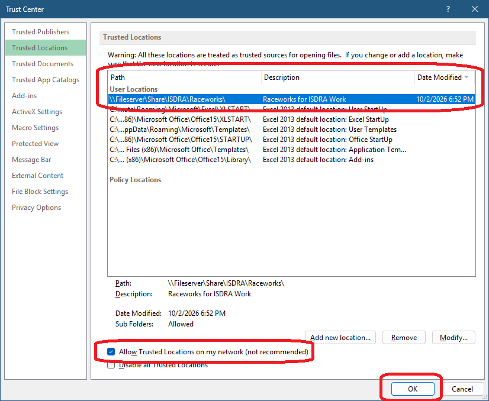

::: warning
**Use the server's name, never its IP address.** Windows treats any network path containing
dots, such as `\\192.168.1.2\...` or `\\server.example.org\...`, as an *internet* location.
Excel refuses it as a Trusted Location (it says the path *cannot be used as a Trusted Location
for security reasons*) and opens files from it in Protected View. Open the file using the
server's name too: a drive letter mapped to the server's name is fine, but not a recent-files
entry or shortcut that uses the IP address.
:::

# Troubleshooting

**A yellow PROTECTED VIEW bar with an Enable Editing button.**
The file isn't in a Trusted Location: it was downloaded, emailed, opened from a network share
by IP address, or opened from somewhere other than your RaceWorks folder. Don't click
*Enable Editing*. Close Excel, move the file into your RaceWorks folder and unblock it (see
*Files you receive by download or email*), and open it again.

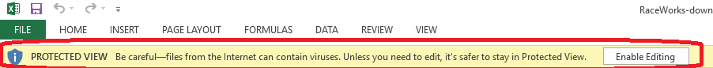

If you do click *Enable Editing* (and *Enable Content*), RaceWorks may not be able to load
its toolbars. RaceWorks 2026.1 then shows the message below and closes the RaceWorks file
(your other workbooks stay open); earlier versions may stop with *Run-time error '91'*. Either
way, open RaceWorks again from your RaceWorks folder.

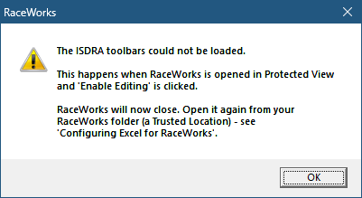

**A yellow SECURITY WARNING bar with an Enable Content button.** It may say *Some active
content has been disabled*, *Macros have been disabled* or *External data connections have
been disabled*, depending on what Excel blocked. The file is not in your Trusted Location. Close it and open RaceWorks from your RaceWorks
folder. Check the folder in Step 5 is the one the file is really in, and that *Subfolders* is
ticked if the file is in a subfolder. Clicking *Enable Content* works, but only for that one
file. Excel asks again if the file is renamed, moved or replaced, which happens every time you
*Save As* a new race file.

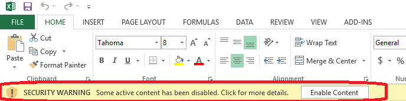

**A red SECURITY RISK bar (Microsoft 365).** See *Files you receive by download or email*.

**Excel freezes or shows "Not Responding" while RaceWorks starts.**

1. **First, press Alt+Tab.** A RaceWorks start-up window may have opened *behind* another
   window, which makes Excel look frozen. If you find it, carry on as normal.
2. If Excel really is stuck, close it: click the **X** at the top right of the Excel window.
   Windows says Excel isn't responding and offers to close it; choose **Close the program**.
   (If that doesn't work, press **Ctrl+Shift+Esc** to open Task Manager, select
   **Microsoft Excel**, and click **End task**.) Wait until Excel has completely closed; it can
   take a few seconds. Any unsaved work in other open Excel files is lost.
3. Start Excel **on its own**, from the Start menu, not by opening the RaceWorks file. If Excel
   offers to recover RaceWorks in a *Document Recovery* pane, close the pane without opening it.
4. **Versions of RaceWorks before 2026.1** can freeze like this when **Trust access to the VBA
   project object model** is unticked. Ask the maintainer for the current version. To keep using
   the older one in the meantime: open a **Blank workbook**, tick that setting (Steps 2 and 3, item 2),
   click OK twice, and close Excel.
5. Now open RaceWorks from your RaceWorks folder.

**The Trust Center settings are grayed out.**
Your computer is managed by an organization. Ask your IT department to add your RaceWorks
folder as a Trusted Location, or use a computer you control.

**The RaceWorks toolbars appear in other workbooks, even after restarting Excel.**
Excel keeps one set of RaceWorks toolbars for all workbooks. They are removed only when
RaceWorks is the **last** workbook you close. If you close another workbook after RaceWorks,
the toolbars stay behind, and Excel keeps them even after a restart. It's fine to have other
spreadsheets open while you use RaceWorks. Just **close RaceWorks last**. To clear toolbars
that have stayed behind, open a RaceWorks file on its own and then close it.

**A "Microsoft Excel Security Notice" says *Automatic update of links has been disabled*.**
Click **Disable**. If this happens when you click a RaceWorks toolbar button, the toolbars are
left over from another copy of RaceWorks and are trying to run that copy. Close Excel, then
open the RaceWorks file you want to use on its own. (RaceWorks 2026.1 fixes this
automatically.)

**RaceWorks says this copy has expired.**
Some copies of RaceWorks for race-day use stop working after a set date. Contact the
maintainer for a current copy.

# Getting help

Contact the RaceWorks maintainer:

**John K. Gates**  
Email: [john.gates@isdra.org](mailto:john.gates@isdra.org)  
Phone: 315-725-1664

Please include:

- your Excel version: **File > Account > About Excel** (the first line, including 32-bit or
  64-bit);
- where the RaceWorks file is (for example *Documents > RaceWorks*, or OneDrive or Dropbox);
- a screenshot of any message or colored bar you see.

# For IT staff: where these settings live

These settings are per user, in the registry under
`HKEY_CURRENT_USER\Software\Microsoft\Office\<version>\Excel\Security`, where `<version>` is
`15.0` for Excel 2013 and `16.0` for Excel 2016, 2019, 2021, 2024 and Microsoft 365.

| Setting                                      | Registry value                                                                                                                                |
| -------------------------------------------- | --------------------------------------------------------------------------------------------------------------------------------------------- |
| Macro setting                                | `VBAWarnings`: 1 = enable all, 2 = disable with notification (default), 3 = disable except digitally signed, 4 = disable without notification |
| Trust access to the VBA project object model | `AccessVBOM`: leave at 0 (off). RaceWorks versions before 2026.1 may need 1                                                                    |
| Allow Trusted Locations on my network        | `Trusted Locations\AllowNetworkLocations` = 1                                                                                                 |
| A Trusted Location                           | `Trusted Locations\Location<n>\Path`, plus `AllowSubfolders` = 1                                                                              |

Group Policy settings under `HKEY_CURRENT_USER\Software\Policies\Microsoft\Office\<version>\...`
override these, and gray the options out in Excel.
