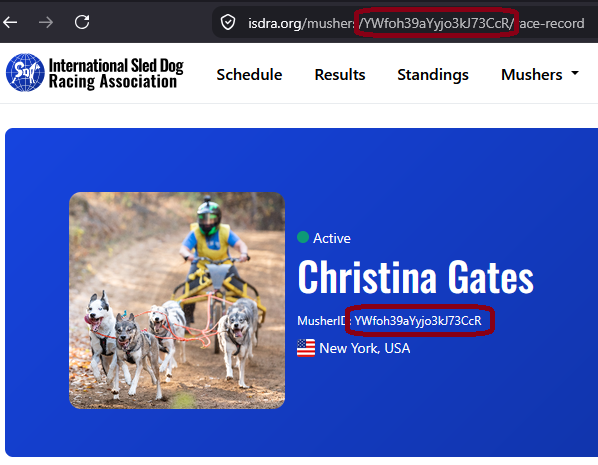

# About this guide

After every ISDRA sanctioned race, the race-giving organization (RGO) sends us the results. We use them to award
championship points, update the standings and seed lists, and publish the results on
[isdra.org](https://isdra.org).

This guide lists what the results must include, and why. It applies however the race was timed: with RaceWorks, with
other timing software, or by hand. Most of it is a matter of being complete and unambiguous; very little of it is about
format.

::: note
**Why the detail matters.** Points for one race depend on who entered it, how far they ran and the purse awarded. Those
points then feed the standings, the seed lists and the points for later races. A result we have to guess at, or correct
after it's posted, can change other drivers' points and standings too. Complete results the first time save everyone
that trouble.
:::

# When and how to send results

- **When:** as soon as possible, and no later than **24 hours after the final heat** (ISDRA Sanctioning Requirements
  and Standards, section K).
- **How:** by email, to [raceresults@isdra.org](mailto:raceresults@isdra.org).
- **Format:** any electronic format is fine (a spreadsheet, a timing program's export, or a RaceWorks workbook), as
  long as it contains everything listed in this guide. Please don't send photos or scans of paper results. If
  possible, send the files straight from your timing, rather than copying the results into another form or
  spreadsheet: every copy is another chance for mistakes.
- If you timed with **RaceWorks**, you can simply send the workbook. Check it first against the checklist below,
  especially mileage and purse.

# Checklist

Before you send results, check that they include:

| Item | What we need |
|-----|---------------|
| Classes | Every entry clearly assigned to one sanctioned class (Division, Type, Class, Category) |
| Groups | For grouped classes, each entry's group: All Breed, Registered Breed or Sportsman |
| Entries | The **full** list of entries in each class, including drivers who didn't run, didn't finish or were disqualified |
| Times | An elapsed time **or** DNR, DNF or DQ for every entry, for every day |
| Mileage | The **actual** miles run, for every class, for every day |
| Purse | The **actual** purse awarded in each class, for All Breed and Registered Breed separately, or a clear "no purse" |
| Names | Spelled correctly, and as close as possible to the name on the driver's ISDRA profile |
| ISDRA IDs | Optional, and only for current members |
| Unsanctioned classes | Left out, or clearly marked as unsanctioned |

Each item is explained below.

# Classes

Every result line must belong, clearly, to one of the classes that were sanctioned for your event. ISDRA identifies a
class by four parts, often shortened to **DTCC**:

| Part | Meaning | Examples |
|------|----------|----------------|
| **D**ivision | Adult or Junior | Adult, Junior |
| **T**ype | The kind of team | Sled, Rig, Bikejoring, Scooter, Canicross, Skijoring |
| **C**lass | The number of dogs | 1 dog, 2 dog, 4 dog, 6 dog, Unlimited |
| **C**ategory | The kind of race | Speed (most races), Mid-distance, Distance |

For most sprint races, a short name such as "2 dog bikejoring" is enough, and is taken to mean an adult speed class; add
"Junior" for a junior class. However, the closer you are to the full DTCC, the better.

You can put several classes in one spreadsheet, as long as every entry shows which class it's in. For example, all the
canicross results can share a sheet if each entry is marked men's or women's. If instead the class is only shown once,
at the top of a sheet or a section, that sheet or section must contain entries from that class only.

::: warning
**The classes in your results must match the classes you were sanctioned for.** Changing the list of sanctioned classes
after the event (for example, combining or splitting classes) is generally not allowed. It has occasionally been allowed
for good reasons such as safety, but only when coordinated with ISDRA, and it's strongly discouraged.
:::

# Groups

If a class was run with groups, show each entry's group:

- **All Breed**
- **Registered Breed**
- **Sportsman**

All Breed and Sportsman are treated as one large group for standings, but Registered Breed is not, and all three are
shown separately when results are published on the website.

Results are often sent as separate tables per group, such as "4 dog rig All Breed" and "4 dog rig Registered Breed".
That's fine, but make it clear that the tables are groups of **the same class**, not separate classes.

# The full list of entries

Send **every** entry in each class, including drivers who didn't run, didn't finish or were disqualified. We need the
full list to calculate points and to assess fees.

# Times

For every entry, for every day of the event, give either an elapsed time or one of these codes:

| Code | Meaning |
|-----|---------------|
| **DNR** | Did not run: the driver didn't leave the start chute that day |
| **DNF** | Did not finish: the driver left the start chute but didn't complete the race that day |
| **DQ** | Disqualified: the Race Marshal disqualified the driver |

Every entry needs a time or a code for every day. "Scratch", "--", a blank cell and similar notes are not enough,
because each code is handled differently in the points calculation. If a driver was disqualified, a short note on why is
helpful here; otherwise the reason should at least be in the Race Marshal's report.

Please give times to **tenths of a second**, or better, **hundredths**. ISDRA's rules don't currently require it, and
whole seconds are accepted, but finer times avoid ties. This matters most in sprint racing.

# Mileage

Give the **actual** miles run, for **every** class and for **each** day it ran.

Use the distance actually run, not the distance advertised or given on the sanctioning application. Trails are often
changed at the event because of conditions or weather, and points are calculated from the actual distance.

# Purse

Give the **actual** purse **awarded** in each class, not the amount advertised if it differs:

- the total awarded to **All Breed**, and
- the total awarded to **Registered Breed**, if the class had a Registered Breed group.

The amount paid often differs from the amount advertised: for example, a sponsor adds money at the last minute, or not
enough teams entered to pay every advertised place.

**If a class had no purse, say so.** Purse is the item most often left out of results, so we can't tell a missing purse
from no purse.

Purses aren't usually awarded to the Sportsman group or to junior classes. The rules don't forbid it, and some RGOs do, but
the usual practice is not to award purses to juniors. For more details, contact ISDRA's Executive Director or your
regional or at-large director.

::: note
**A rule many RGOs don't know about.** In any class, the purse for the Registered Breed group, or any other group, may
not exceed the All Breed purse ([Sanctioning Requirements and Standards](https://isdra.org/assets/documents/SancReqsAdults2026.pdf),
section B.4.g). For Registered Breed, the amount for any placing also may not exceed the amount for the same placing in
All Breed ([Registered Breed Group Standard](https://isdra.org/assets/documents/Registered_Breed_Group_Standard_2016-11.pdf),
section D, paragraphs 1 and 3). Both documents are on [isdra.org](https://isdra.org), in the menu at the top of the
page: the first under [**About ISDRA > Rules & Regulations**]{style="white-space: nowrap"}, the second under [**About ISDRA > Programs**]{style="white-space: nowrap"}, then
**Registered Breed Group**.
:::

# Names

Spell every name correctly, and as close as possible to the name on the driver's ISDRA profile. You can look members up
in the musher directory on the ISDRA website: go to [isdra.org](https://isdra.org) and choose [**Mushers > Directory**]{style="white-space: nowrap"}
in the menu at the top of the page, or go straight to [[isdra.org/mushers](https://isdra.org/mushers)]{style="white-space: nowrap"}.

We match each name to an ISDRA member to award points. Drivers often register under a slightly different name from the
one on their profile, such as Kathy instead of Katherine, or a maiden name instead of a married name. Each mismatch
takes detective work to resolve, and an unrecognized name can mean a member misses out on points.

# ISDRA IDs (optional)

Including ISDRA IDs is optional, but it helps. So does simply marking which entries are current ISDRA members.

Names can be ambiguous. One recent race had three entries for "Christine Taylor" and one for "Christi Taylor". Probably
not the same person, but an ID, or even a note that one of them is a current member, settles it, or at least tells us
to look more closely.

- Include IDs only for **current** members. Don't include an ID for a non-member, or for a member whose membership has
  expired.
- To find an ID, search for the member in the musher directory (see *Names* above) and open their profile.
- Check that the membership is current. Just above the name, a green dot and **Active** mean a current member; a red
  dot and **Inactive** mean the membership has expired, so leave the ID out.
- The ID is the 20-character string of letters and numbers labeled **MusherID**, just under the name in the blue bar.
  It also appears in the profile page's web address, between `/mushers/` and `/race-record`.

{height=2.3in}

# Unsanctioned classes

Ideally, send results for sanctioned classes only. If your results also include classes that weren't sanctioned, mark
clearly which classes are sanctioned and which aren't.

# Corrections after results are posted

We check each set of results, and ask you about anything unclear, before we post them. Even so, mistakes sometimes
surface later.

Correcting results after they're posted can change points and standings for everyone in the affected classes. It can
also change the seed list used later in the season, and with it the points for later races. So:

- please check your results carefully before sending them, and
- if you find a mistake in posted results, tell us as soon as possible. We'll do the same if we find one.

# Getting help

For questions about results, or to send them:

Email: [raceresults@isdra.org](mailto:raceresults@isdra.org)

This address reaches **John K. Gates**, Data and Technology Manager, who can also be reached by phone at 315-725-1664.

Thank you. Much of this may seem like a lot of detail, but each item helps us put the right points in the right place,
and saves everyone corrections later.
